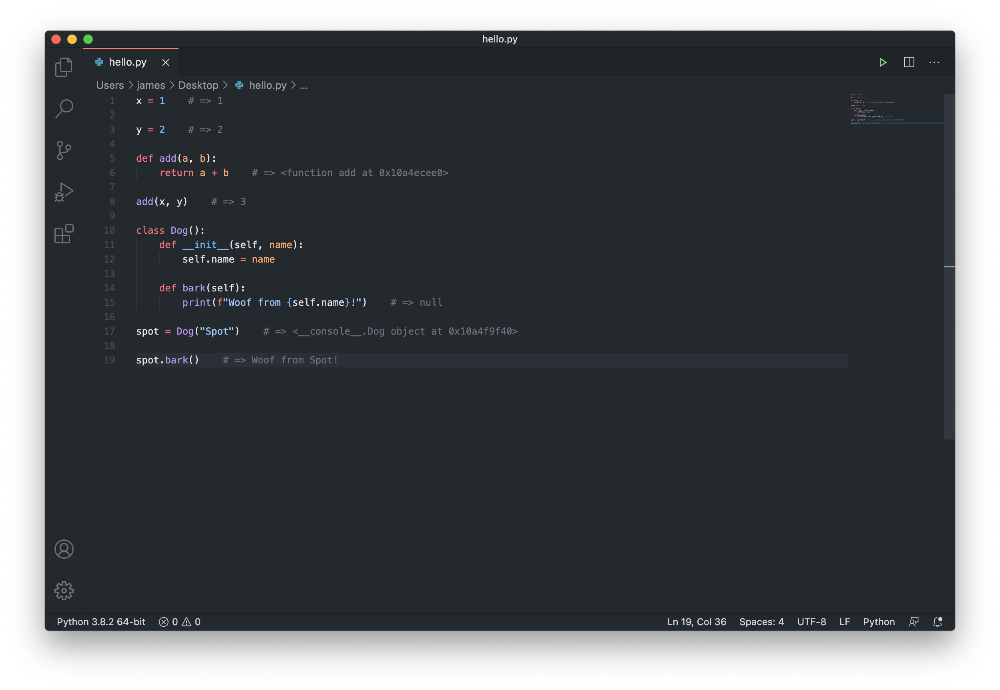

# shinkansen

## Introduction

Shinkansen is an experiment in **live programming** by bringing the power of the REPL to your source editor. It currently supports Python programs.

Write an expression, hit `Command + Enter`, and Shinkansen will evaluate and display the results next to your cursor. Gone are the days of copying and pasting code into a cumbersome REPL window while missing out on all of the great Intellisense features of VSCode.



### Why do we need this?

It's 2020 and we've yet to see a significant improvement in the way programs are written. Linear text files, compilation, entry points, and a separate debug mode are still prevalent in almost all programming languages.

The workflow of editing discrete text files, compiling them into an executable, and then running it remains true today. Testing a minute change in a program means going through the entire process of running your program from scratch. There's no instant feedback loop; just wasted time.

Most scripting languages ship with a REPL (Java even has one now!) which attempts to address some of these problems by providing a prompt for you to evaluate expressions. The issue with most REPLs today (an exception is Clojure and the other Lisp dialects) is that they're fundamentally disconnected from the source code and program you write in your editor. To test something out, you need to copy and paste blocks of source code from one program into another; neither of which is aware of the existence of the other.

Shinkansen aims to demonstrate what an _omnipresent_ REPL would feel like in VSCode. Here, you interact with the REPL through the same interface you use to edit your source code. You don't need to copy and paste and fiddle with an antiquated REPL prompt.

### How does it work?

Shinkansen activates when supported file type is open and active (currently Python `.py` files only). In the background, it spins up a remote REPL to receive and evaluate expressions, as well as maintaining the state of a program. Each time you hit `Command + Enter`, Shinkansen queries a Language Server to determine the symbol being evaluated, and uses some heuristics to try and determine the entire source range of the expression.

For example:

```py
x = 1
```

gets parsed as the symbol `x` by the Language Server, and is translated into the expression `x = 1` which is then sent to the remote REPL.

For functions such as

```py
def add(a, b):
    return a + b
```

the Language Server returns the symbol `add` with the expression `def add(a, b):\n    return a + b` being sent to the remote REPL.

## Installation

### Prerequisites

- Python 3.8
  - To test your installation, try running `python3` in your terminal. It should start a Python REPL.
- VSCode 1.50.1
- VSCode extensions (these should also be installed automatically with Shinkansen, but just to be sure!):
  - [Python](https://marketplace.visualstudio.com/items?itemName=ms-python.python)
  - [Pylance](https://marketplace.visualstudio.com/items?itemName=ms-python.vscode-pylance)
    - Also ensure that this is set as your **default** language server. To do this, search for `Python: Language Server` in the Settings, and ensure that `Pylance` is selected in the drop-down.

Since the extension isn't published on the Marketplace, you'll need to install the `.vsix` file manually. To do this:

1. Download the `shinkansen-0.0.1.vsix` file from the [Releases page](https://github.com/disposedtrolley/shinkansen/releases).
2. Install the extension into VSCode by running `code --install-extension <path/to/shinkansen-0.0.1.vsix>`


### Usage

1. Create a new `.py` file with VSCode and type in `x = 1`.
2. Move your cursor to the end of that line, and hit `Command + Enter`.
3. You should see the line change to `x = 1  # => 1`. This confirms it's working!

For something a little more advanced, let's define a class, create an instance of it, and call an instance method.

1. Type the following in the same `.py` file:

```py
class Dog():
    def __init__(self, name):
        self.name = name
    
    def bark(self):
        print(f"Woof woof from {self.name}")
```

2. Place your cursor at the end of the `print()` function, and hit `Command + Enter`. You should see the result `null`.
3. Create a new Dog called Spot:

```py
d = Dog("Spot")
```

4. Evaluate the expression by hitting `Command + Enter` at the end of the line. You should see some information about Spot.
5. Make Spot bark:

```py
d.bark()
```

6. Again, move the cursor to the end of the line evaluate with `Command + Enter`. You should see the result `Woof woof from Spot`.

This is just a taste of what Shinkansen currently supports! You can play around with some expressions of your own, and even try `import`ing modules to use their functionality.  If results stop appearing, try restarting VSCode.